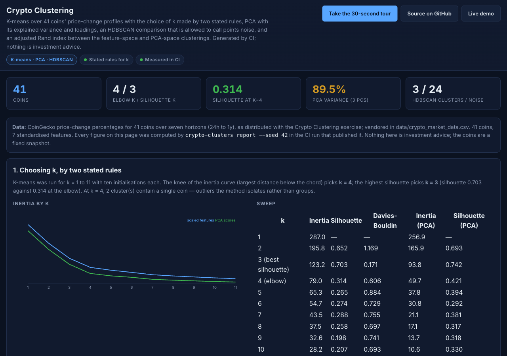
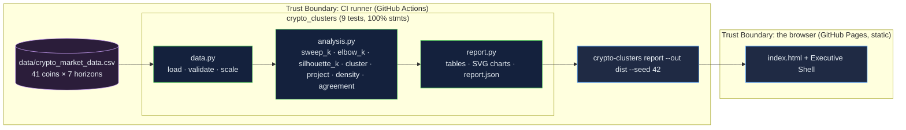

# Crypto-Clustering: K-means with the choice of k made by stated rules, PCA that is read, and a method allowed to say "noise"

[](https://github.com/Freddricklogan/Crypto-Clustering/actions/workflows/deploy.yml)
[](#5-getting-started--verification)
[](https://github.com/Freddricklogan/Crypto-Clustering/actions/workflows/codeql.yml)
[](LICENSE)
[](https://freddricklogan.github.io/Crypto-Clustering/)

## 1. Executive Summary & Business Impact

**Problem statement.** The cryptocurrency clustering exercise asks
which coins move alike across seven horizons. The previous version of
this repository was a script that set `k = 4` as a constant after
plotting an elbow, clustered PCA scores without comparing them to the
original, would have invented forty random coins if the CSV were
missing — and shipped a CSV truncated to 16 of the 41 coins
(`AUDIT.md`).

**Solution & value delivered.** A package that vendors the full
41-coin table, validates it, and chooses k by two stated rules — the
knee of the inertia curve (k = 4) and the maximum silhouette
(k = 3) — reporting both with their memberships. It reads PCA rather
than just running it: three components explain 89.5 % of the variance,
the loadings show which horizons drive each, and clustering the scores
gives an adjusted Rand index of 1.000 against the full feature space.
It runs HDBSCAN beside K-means because a density method may leave
points unassigned; it leaves 24 of 41, which is the honest shape of a
small heavy-tailed table. CI builds and publishes the report.

**[→ Read the full case study](docs/CASE_STUDY.md)**



## 2. Demonstrated Competencies & Technical Skills

- **Unsupervised Learning** — K-means with seeded multi-start, knee
  and silhouette rules, silhouette and Davies–Bouldin, PCA explained
  variance and loadings, HDBSCAN, adjusted Rand index.
- **Data Engineering** — schema validation, standardisation, vendored
  data with provenance, reproducibility from one seed.
- **Engineering Practice** — typed package with a CLI, 9 tests at
  100 % statement coverage including synthetic-curve tests of the
  selection rules, ruff / mypy strict / bandit / pip-audit / Trivy,
  static report generated and deployed by CI.

## 3. System Architecture & Data Flow



## 4. Technical Highlights & Engineering Decisions

### ADR-1 — Two rules for k, both reported

**Context.** "Pick k from the elbow" is a judgement; a constant in the
code hides it.

**Decision.** `elbow_k` finds the point farthest below the chord of
the normalised inertia curve; `silhouette_k` takes the best silhouette.
Both are computed, both memberships are shown, and singletons are
counted and named as outliers.

**Consequence.** On this data the rules disagree (4 against 3) and the
page says so instead of choosing silently; tests pin both rules on
synthetic curves.

### ADR-2 — PCA is read, and its clustering is compared

**Context.** The old script clustered PCA scores and moved on.

**Decision.** Report explained variance per component, the loadings
table, and the adjusted Rand index between full-feature and PCA-space
clusterings at the same k.

**Consequence.** A reader sees that three components carry 89.5 % and
that reducing dimensions changed nothing about the partition (ARI
1.000).

### ADR-3 — A density method beside K-means

**Context.** K-means must assign every coin; with two singletons at
k = 4 it was assigning outliers to clusters of one.

**Decision.** HDBSCAN with a minimum cluster size of 3 runs on the same
scaled table; clusters, noise count and the silhouette over assigned
points are reported.

**Consequence.** 3 dense clusters and 24 unassigned coins — a different
and arguably more honest description of the same table, presented
beside the first rather than instead of it.

## 5. Getting Started & Verification

**Prerequisites.** Python 3.12 and `uv`.

```bash
git clone https://github.com/Freddricklogan/Crypto-Clustering.git
cd Crypto-Clustering
uv venv && uv pip install -e ".[dev]"
make check                                        # lint, typecheck, test, security, build
uv run crypto-clusters report --out dist --seed 42  # dist/index.html + report.json
```

**Verification — the numbers this repository actually produced (seed 42):**

| Check | Result |
| --- | --- |
| Tests (pytest) | **9 passed / 9** |
| Coverage | **100%** statements over `crypto_clusters` (CLI excluded) |
| ruff, ruff format, mypy --strict | clean |
| bandit, pip-audit | 0 findings; no known vulnerabilities |
| Data | 41 coins × 7 standardised horizons |
| k sweep (1–11) | inertia 287.0 → 24.1; knee k = 4 (silhouette 0.314); best silhouette k = 3 (0.703); sizes at k = 4: 13 / 1 / 26 / 1 |
| PCA | explained 37.2 % / 34.7 % / 17.6 % = 89.5 %; ARI full-feature vs PCA at k = 4: 1.000 |
| HDBSCAN (min cluster size 3) | 3 clusters, 24 noise, silhouette over assigned 0.519 |
| Report smoke (headless Chrome) | **0 console errors**; 5 tables, 41 scatter points, 2 curves, 4 tour steps; no horizontal scroll at 1280 or 400 px |

## 6. Live Demo & Production Showcase

**<https://freddricklogan.github.io/Crypto-Clustering/>** — the report
CI built, with `report.json` beside it.

**30-second guided walkthrough.** Press **Take the 30-second tour**:
the two rules for k, what PCA says, and what HDBSCAN refuses to say.
